# ACE Learning Adapter Architecture

**Type:** Architecture Diagram
**Last Updated:** 2026-01-11
**Related Files:**
- `src/ralph_orchestrator/learning/ace_adapter.py` (1131 lines)
- `src/ralph_orchestrator/orchestrator.py:760` (inject_context call)
- `.agent/skillbook/skillbook.json` (Persisted skills)

## Purpose

Enables the orchestrator to learn from every execution, accumulating strategies that improve over time. Users benefit from an agent that gets smarter with use - making fewer mistakes and completing tasks more efficiently.

## ACE Learning Flow

```mermaid
graph TD
    subgraph "Front-Stage (User Experience)"
        User[Developer] --> FasterTasks[Tasks Complete Faster ⚡ Learning compounds]
        FasterTasks --> FewerErrors[Fewer Repeated Errors 🛡️ Learns from mistakes]
        FewerErrors --> CostSavings[Cost Savings 💾 Efficient strategies]
    end

    subgraph "Back-Stage (Learning Pipeline)"
        direction TB
        Orchestrator[Orchestrator] --> InjectPhase[Inject Phase ⚡]
        Orchestrator --> LearnPhase[Learn Phase ⏱️ Async]

        InjectPhase --> GetSkills[Get Active Skills]
        GetSkills --> TopK{TOP-K Configured?}
        TopK -->|Yes| SortByScore[Sort by Score 📊]
        TopK -->|No| AllSkills[Use All Skills]
        SortByScore --> SelectTop[Select TOP-K ⚡]
        SelectTop --> FormatSkills[Format for Prompt]
        AllSkills --> FormatSkills
        FormatSkills --> EnhancedPrompt[Enhanced Prompt 🎯]

        LearnPhase --> Queue[Learning Queue 💾]
        Queue --> Worker[Background Worker ⏱️]
        Worker --> Reflector[Reflector 📊 Analyze execution]
        Reflector --> SkillManager[SkillManager 🎯 Update skills]
        SkillManager --> Skillbook[Skillbook 💾]
    end

    subgraph "Skill Lifecycle"
        SkillManager --> AddSkill[Add New Skill ✅]
        SkillManager --> UpdateSkill[Update Existing 🔄]
        SkillManager --> PruneSkill[Prune Low-Score ⚡]
        SkillManager --> Dedup[Deduplicate 💾]

        AddSkill --> Skillbook
        UpdateSkill --> Skillbook
        PruneSkill --> Skillbook
        Dedup --> Skillbook
    end

    EnhancedPrompt --> User
    Skillbook --> GetSkills
```

## Async Learning Worker

```mermaid
sequenceDiagram
    participant Orch as Orchestrator (Main Thread)
    participant Queue as Learning Queue
    participant Worker as Worker Thread
    participant Reflector as ACE Reflector
    participant SkillMgr as ACE SkillManager
    participant Book as Skillbook

    Note over Orch,Book: Non-Blocking Learning Flow

    Orch->>Queue: Put LearningTask ⚡
    Note over Queue: Task queued, main thread continues

    loop Worker Thread Loop
        Worker->>Queue: Get task (timeout=1s)

        alt Task available
            Worker->>Reflector: reflect(task, output, feedback)
            Note over Reflector: Analyze execution ⏱️ ~500ms
            Reflector-->>Worker: Reflection result

            Worker->>SkillMgr: update_skills(reflection)
            Note over SkillMgr: Generate skill update 📊
            SkillMgr-->>Worker: Skill update

            Worker->>Book: apply_update(update) 💾
            Note over Book: Deduplicate, prune if needed

            Worker->>Worker: Update stats
        else No task
            Worker->>Worker: Sleep, check shutdown
        end
    end

    Note over Orch,Book: Shutdown Flow
    Orch->>Worker: Signal shutdown
    Worker->>Book: Save to disk 💾
    Worker-->>Orch: Worker stopped
```

## TOP-K Skill Selection

```mermaid
graph TD
    subgraph "Skill Scoring"
        AllSkills[All Skills in Skillbook] --> Calculate[Calculate Score]
        Calculate --> Formula[Score = helpful - harmful]

        Skill1[Skill 1: helpful=5, harmful=1] --> Score1[Score: 4]
        Skill2[Skill 2: helpful=3, harmful=0] --> Score2[Score: 3]
        Skill3[Skill 3: helpful=2, harmful=3] --> Score3[Score: -1]
        Skill4[Skill 4: helpful=1, harmful=5] --> Score4[Score: -4]
    end

    subgraph "Selection (TOP-K=3)"
        Score1 --> Sort[Sort Descending 📊]
        Score2 --> Sort
        Score3 --> Sort
        Score4 --> Sort

        Sort --> Select[Select TOP-K ⚡]
        Select --> Selected1[Skill 1: Score 4 ✅]
        Select --> Selected2[Skill 2: Score 3 ✅]
        Select --> Selected3[Skill 3: Score -1 ✅]
        Select --> Excluded[Skill 4: Excluded 🔄]
    end

    subgraph "Token Savings"
        Selected1 --> Inject[Inject 3 skills]
        Selected2 --> Inject
        Selected3 --> Inject
        Inject --> Savings[~40-60% fewer tokens ⚡]
    end
```

## LearningConfig Options

## Telemetry Events

```mermaid
graph LR
    subgraph "Event Types"
        INIT[INIT 🎯 Adapter initialized]
        INJECT[INJECT ⚡ Skills added to prompt]
        REFLECT[REFLECT 📊 Reflector ran]
        UPDATE[SKILL_UPDATE 💾 Skill modified]
        PRUNE[PRUNE 🔄 Low-score removed]
        SAVE[SAVE 💾 Skillbook persisted]
        ERROR[ERROR ⚠️ Operation failed]
    end

    subgraph "Stats Tracking"
        Stats[Telemetry Stats]
        Stats --> ReflectCount[reflections_count]
        Stats --> AddedCount[skills_added]
        Stats --> UpdatedCount[skills_updated]
        Stats --> PrunedCount[skills_pruned]
        Stats --> DedupCount[skills_deduplicated]
        Stats --> InjectCount[inject_count]
        Stats --> ErrorCount[errors_count]
        Stats --> TotalTime[total_learning_time_ms]
        Stats --> QueuedCount[async_tasks_queued]
        Stats --> ProcessedCount[async_tasks_processed]
        Stats --> RollbackCount[rollback_learnings]
    end
```

## Rollback Learning

```mermaid
sequenceDiagram
    participant Orch as Orchestrator
    participant Adapter as ACELearningAdapter
    participant Reflector as Reflector
    participant Book as Skillbook

    Note over Orch,Book: Learn from failures

    Orch->>Adapter: learn_from_rollback(failed_iterations=5, target="abc123", reason="Max failures")
    Note over Adapter: Create special learning task 📊

    Adapter->>Reflector: reflect(rollback_context)
    Note over Reflector: Analyze failure patterns ⚡

    Reflector-->>Adapter: Reflection with failure insights

    Adapter->>Book: apply_update(failure_skill)
    Note over Book: Add skill to avoid this pattern 🛡️

    Adapter-->>Orch: Learned from rollback ✅
```

## Key Insights

- **Async by Default**: Learning runs in background thread, never blocks iterations
- **TOP-K Selection**: Inject only highest-scoring skills to reduce token overhead
- **Deduplication**: Prevents accumulation of near-duplicate skills (85% similarity threshold)
- **Rollback Learning**: Failed patterns become "what NOT to do" skills
- **Graceful Shutdown**: Worker thread cleans up and saves skillbook on exit

## Measurable Signals

| Signal | Collection Point | Purpose |
|--------|------------------|---------|
| Skills injected | `inject_count` stat | Track injection frequency |
| Skills delta | `skills_added - skills_pruned` | Net skill growth |
| Learning time | `total_learning_time_ms` | Overhead tracking |
| Queue depth | `learning_queue.qsize()` | Backlog monitoring |
| Top skill scores | `get_stats().top_skills` | Skill quality |

## Change History

- **2026-01-11:** Initial creation documenting H5 TOP-K skill injection
