# Adapter Layer Architecture

**Type:** Architecture Diagram
**Last Updated:** 2026-01-11
**Related Files:**
- `src/ralph_orchestrator/adapters/base.py` (Base adapter class)
- `src/ralph_orchestrator/adapters/claude.py` (Claude adapter)
- `src/ralph_orchestrator/adapters/gemini.py` (Gemini adapter)
- `src/ralph_orchestrator/adapters/qchat.py` (Q Chat adapter)
- `src/ralph_orchestrator/adapters/kiro.py` (Kiro adapter)
- `src/ralph_orchestrator/adapters/acp.py` (ACP adapter)

## Purpose

Provides users with flexibility to use any supported AI agent for their tasks, with consistent behavior and automatic fallback. The adapter abstraction ensures tasks complete regardless of which specific AI tool is available.

## Adapter Hierarchy

```mermaid
graph TD
    subgraph "Front-Stage (User Experience)"
        User[Developer] --> Config[ralph.yml: agent: auto]
        Config --> AutoDetect[Auto-Detection ⚡ Best available agent]
        AutoDetect --> Execution[Task Execution ✅]
    end

    subgraph "Back-Stage (Adapter Layer)"
        Orchestrator[Orchestrator] --> AdapterFactory[Adapter Factory 🎯]

        AdapterFactory --> BaseAdapter[BaseAdapter Abstract Class]

        BaseAdapter --> Claude[ClaudeAdapter 🛡️ Primary]
        BaseAdapter --> Gemini[GeminiAdapter]
        BaseAdapter --> QChat[QChatAdapter ⚡ Free tier]
        BaseAdapter --> Kiro[KiroAdapter]
        BaseAdapter --> ACP[ACPAdapter 🎯 Agent protocol]

        Claude --> ClaudeSDK[claude-code SDK]
        Gemini --> GeminiCLI[gemini CLI]
        QChat --> QCLI[q CLI]
        Kiro --> KiroCLI[kiro-cli]
        ACP --> ACPClient[ACP Protocol Client]
    end

    subgraph "Prompt Enhancement"
        BaseAdapter --> Enhance[_enhance_prompt_with_instructions]
        Enhance --> CWD[Add CWD 🛡️ Prevents hallucination]
        Enhance --> Signals[Add Completion Signals ✅]
        Enhance --> Dynamic[Dynamic Templates ⚡ Iter 4+]
    end

    Execution --> Claude
    Execution --> Gemini
    Execution --> QChat
```



## BaseAdapter Interface


## Adapter Auto-Detection


## Prompt Enhancement Flow

```mermaid
graph TD
    subgraph "Input"
        Original[Original Prompt] --> Method[_enhance_prompt_with_instructions]
        Iteration[Iteration Number] --> Method
        CWD[Working Directory] --> Method
    end

    subgraph "Enhancement Logic"
        Method --> IterCheck{iteration <= 3?}

        IterCheck -->|Yes| FullInstructions[Full Instructions ~800 tokens]
        IterCheck -->|No| CondensedInstructions[Condensed ~150 tokens ⚡]

        FullInstructions --> AddCWD[Add: Working Directory: /path/to/project 🛡️]
        CondensedInstructions --> AddCWD

        AddCWD --> AddSignals[Add: Signal completion with LOOP_COMPLETE ✅]
        AddSignals --> AddContext[Add: Read .agent/scratchpad.md 📊]
        AddContext --> AddIterNum[Add: Iteration {n} of max]
    end

    subgraph "Output"
        AddIterNum --> Enhanced[Enhanced Prompt]
        Enhanced --> Agent[To AI Agent]
    end
```

## Adapter Capabilities

```mermaid
graph LR
    subgraph "Claude Adapter"
        C[ClaudeAdapter] --> C1[Context: 200K tokens ⚡]
        C --> C2[Tools: Full MCP support 🎯]
        C --> C3[Cost: $3/$15 per 1M 💾]
        C --> C4[Trust Tools: Configurable 🛡️]
    end

    subgraph "Gemini Adapter"
        G[GeminiAdapter] --> G1[Context: 32K tokens]
        G --> G2[Tools: Limited]
        G --> G3[Cost: $0.25/$1 per 1M ⚡]
    end

    subgraph "Q Chat Adapter"
        Q[QChatAdapter] --> Q1[Context: 8K tokens]
        Q --> Q2[Tools: AWS tools]
        Q --> Q3[Cost: Free ⚡]
    end

    subgraph "ACP Adapter"
        A[ACPAdapter] --> A1[Context: Varies]
        A --> A2[Tools: Protocol-based 🎯]
        A --> A3[Cost: Varies]
    end
```



## Error Handling and Retry

```mermaid
graph TD
    subgraph "Execution Flow"
        Execute[adapter.aexecute(prompt)] --> Result{Success?}

        Result -->|Yes| Response[Return AdapterResponse ✅]
        Result -->|No| ErrorCheck{Error Type?}

        ErrorCheck -->|Timeout| Retry1[Retry with backoff ⏱️]
        ErrorCheck -->|Rate Limit| Retry2[Wait and retry 🔄]
        ErrorCheck -->|Fatal| Fail[Return error response]

        Retry1 --> RetryCheck{Retry count < max?}
        Retry2 --> RetryCheck

        RetryCheck -->|Yes| Execute
        RetryCheck -->|No| Fail
    end

    subgraph "Backoff Strategy"
        Backoff[Exponential Backoff] --> B1[Attempt 1: 2s]
        B1 --> B2[Attempt 2: 4s]
        B2 --> B3[Attempt 3: 8s]
        B3 --> B4[Attempt 4: 16s]
        B4 --> BMax[Max attempts reached]
    end
```

## ACP Protocol Integration

```mermaid
sequenceDiagram
    participant Orch as Orchestrator
    participant ACP as ACPAdapter
    participant Client as ACPClient
    participant Agent as Remote ACP Agent

    Orch->>ACP: aexecute(prompt)
    Note over ACP: Build ACP request message

    ACP->>Client: send(message)
    Note over Client: Serialize to ACP protocol 📊

    Client->>Agent: ACP Request (HTTP/WS)
    Note over Agent: Process with remote agent 🎯

    Agent-->>Client: ACP Response
    Note over Client: Deserialize response

    Client-->>ACP: AgentOutput
    Note over ACP: Convert to AdapterResponse

    ACP-->>Orch: AdapterResponse ✅
```



## Key Insights

- **Abstraction Layer**: All adapters share common interface, enabling easy addition of new agents
- **Prompt Enhancement**: CWD injection and completion signals applied uniformly across all adapters
- **Dynamic Templates**: Condensed instructions for iteration 4+ reduce token overhead
- **Graceful Fallback**: Auto-detection ensures orchestration can proceed with any available agent

## Measurable Signals

| Signal | Collection Point | Purpose |
|--------|------------------|---------|
| Available adapters | `orchestrator.available_adapters` | System capability |
| Primary tool | `orchestrator.primary_tool` | Active adapter |
| Adapter success | `AdapterResponse.success` | Execution quality |
| Adapter cost | `AdapterResponse.cost` | Budget tracking |

## Change History

- **2026-01-11:** Initial creation documenting adapter layer and H3 CWD fix
