# Completion Signal Detection Architecture

**Type:** Architecture Diagram
**Last Updated:** 2026-01-11
**Related Files:**
- `src/ralph_orchestrator/orchestrator.py:690-730` (Completion detection methods)
- `src/ralph_orchestrator/adapters/base.py:57-150` (Prompt enhancement)
- `docs/validation/HYPOTHESIS_VALIDATION_REPORT.md` (Validation evidence)

## Purpose

Enables the orchestrator to detect when an AI agent has genuinely completed its task, reducing wasted verification iterations by 67% and cutting costs by 82%. Users get faster results without paying for unnecessary API calls.

## Completion Detection Flow

```mermaid
graph TD
    subgraph "Front-Stage (User Experience)"
        User[User Runs Task] --> Result[Task Complete Faster ⚡ 67% fewer iterations]
        Result --> CostSaved[Cost Reduced 💾 82% savings]
    end

    subgraph "Back-Stage (Detection Pipeline)"
        AgentOutput[Agent Response Output] --> Parser[Output Parser 📊 Scans for signals]

        Parser --> MarkerCheck{Contains TASK_COMPLETE marker?}
        MarkerCheck -->|Yes| MarkerFound[Marker Detection ✅ In-file completion]
        MarkerCheck -->|No| PromiseCheck

        PromiseCheck{Contains LOOP_COMPLETE?}
        PromiseCheck -->|Yes| PromiseFound[Promise Detection ✅ Output signal]
        PromiseCheck -->|No| Continue

        MarkerFound --> Complete[Task Complete 🎯]
        PromiseFound --> Complete

        Continue[Continue Orchestration 🔄] --> NextIter[Next Iteration]
    end

    subgraph "Prompt Enhancement (Prevention)"
        Enhanced[Enhanced Prompt 🛡️] --> Instructions[Completion Instructions]
        Instructions --> |"Signal: LOOP_COMPLETE"| AgentOutput
        Instructions --> |"Marker: [x] TASK_COMPLETE"| AgentOutput
    end

    Complete --> Result
    NextIter --> AgentOutput
```

## Detection Methods Detail

```mermaid
sequenceDiagram
    actor Agent as AI Agent
    participant Output as Agent Output
    participant Marker as _check_completion_marker()
    participant Promise as _check_completion_promise()
    participant Orch as Orchestrator

    Agent->>Output: Generate response

    Output->>Marker: Check file for marker
    Note over Marker: Regex: /\\[x\\]\\s*TASK_COMPLETE/i
    Note over Marker: Checks PROMPT.md for checkbox ✅

    alt Marker found in file
        Marker-->>Orch: task_complete = True
        Note over Orch: File-based completion detected
    else No marker
        Marker-->>Promise: Continue checking
    end

    Promise->>Output: Check output text
    Note over Promise: Pattern: "LOOP_COMPLETE"
    Note over Promise: Also detects implicit signals ⚡

    alt LOOP_COMPLETE in output
        Promise-->>Orch: task_complete = True
        Note over Orch: Output-based completion detected
    else No signal
        Promise-->>Orch: task_complete = False
        Note over Orch: Continue to next iteration 🔄
    end
```

## Prompt Enhancement Detail

```mermaid
graph LR
    subgraph "Front-Stage"
        Original[Original PROMPT.md]
    end

    subgraph "Back-Stage (Enhancement)"
        Enhance[_enhance_prompt_with_instructions]

        Enhance --> CWD[Add Working Directory 🛡️]
        Enhance --> Signals[Add Completion Signals ✅]
        Enhance --> Context[Add Orchestration Context 📊]

        CWD --> |"Working Directory: /path/to/project"| Enhanced
        Signals --> |"Output LOOP_COMPLETE when done"| Enhanced
        Context --> |"Read .agent/scratchpad.md"| Enhanced

        Enhanced[Enhanced Prompt]
    end

    subgraph "Iteration Awareness"
        Enhanced --> IterCheck{Iteration <= 3?}
        IterCheck -->|Yes| Full[Full Instructions ~800 tokens]
        IterCheck -->|No| Condensed[Condensed ~150 tokens ⚡ Saves 650 tokens]
    end

    Original --> Enhance
```

## Baseline vs Post-Implementation

```mermaid
graph LR
    subgraph "Before (Baseline)"
        B1[Iteration 1: Create file] --> B2[Iteration 2: Verify exists]
        B2 --> B3[Iteration 3: Verify output]
        B3 --> B4[Finally complete]

        Note1[3 iterations, $0.0379]
    end

    subgraph "After (With Signals)"
        A1[Iteration 1: Create file + LOOP_COMPLETE] --> A2[Detected - Stop!]

        Note2[1 iteration, $0.0069 ⚡]

        style A2 fill:#90EE90
        style Note2 fill:#90EE90
    end
```

## Key Insights

- **Dual Detection**: Both file markers (`[x] TASK_COMPLETE`) and output signals (`LOOP_COMPLETE`) are detected
- **Prompt-Driven Behavior**: Agents are explicitly instructed on completion format, increasing compliance
- **Dynamic Templates**: Iterations 4+ receive condensed instructions, saving ~650 tokens per iteration
- **CWD Injection**: Path hallucination eliminated by making working directory explicit

## Measurable Signals

| Signal | Collection Point | Baseline | Post-Impl | Method |
|--------|------------------|----------|-----------|--------|
| Iterations to complete | `orchestrator.aexecute()` return | 3 | 1 | Count loop executions |
| Completion format | `_check_completion_promise()` | None | LOOP_COMPLETE | Pattern match |
| Cost per task | `CostTracker.total_cost` | $0.0379 | $0.0069 | API usage tracking |
| Wasted iterations | Log analysis | 2 (66%) | 0 (0%) | Manual audit |

## Change History

- **2026-01-11:** Initial creation documenting validated H1 hypothesis
