# Context Tracker Architecture

**Type:** Architecture Diagram
**Last Updated:** 2026-01-11
**Related Files:**
- `src/ralph_orchestrator/monitoring/context_tracker.py` (328 lines)
- `src/ralph_orchestrator/orchestrator.py:28,128,752-795` (Integration points)
- `.agent/metrics/context-timeline-*.json` (Output files)

## Purpose

Provides developers with full visibility into how context window tokens are consumed during orchestration, enabling measurement-driven optimization and preventing context exhaustion that would cause task failures.

## Context Tracker Data Flow

## Measurement Points Detail

```mermaid
sequenceDiagram
    participant Orch as Orchestrator
    participant Tracker as ContextTracker
    participant Logger as StreamLogger
    participant File as Timeline JSON

    Note over Orch,File: Per-Iteration Measurement Cycle

    Orch->>Tracker: measure(ITERATION_START, prompt, "initial_prompt")
    Note over Tracker: Count tokens in original prompt 📊
    Tracker->>Logger: 🟢 iteration_start: 68 tokens (0.0%)
    Note over Logger: Emoji indicates health ⚡

    Orch->>Tracker: measure(AFTER_SKILLBOOK_INJECT, enhanced, "skillbook_inject")
    Note over Tracker: Track skillbook overhead 📊
    Tracker->>Logger: 🟢 after_skillbook_inject: +15 tokens

    Orch->>Tracker: measure(AFTER_RESPONSE, full_context, "response_received")
    Note over Tracker: Track agent response size 📊
    Tracker->>Logger: 🟢 after_response: 306 tokens (0.2%)

    Note over Orch,File: End of Session

    Orch->>Tracker: save_timeline()
    Tracker->>File: Write JSON 💾
    Note over File: .agent/metrics/context-timeline-20260111-001440.json
    Tracker->>Orch: Return filepath

    Orch->>Tracker: get_timeline_ascii()
    Tracker-->>Orch: ASCII visualization
    Note over Orch: Display in summary report
```

## Context Window Limits

```mermaid
graph TB
    subgraph "Adapter Context Limits"
        Claude[Claude Adapter] --> C200K[200,000 tokens 📊]
        Gemini[Gemini Adapter] --> G32K[32,000 tokens]
        QChat[Q Chat Adapter] --> Q8K[8,000 tokens]
        Kiro[Kiro Adapter] --> K8K[8,000 tokens]
        Default[Default] --> D100K[100,000 tokens]
    end

    subgraph "Usage Indicators"
        Usage{Usage Percentage}
        Usage -->|< 50%| Green[🟢 Healthy ⚡ Plenty of room]
        Usage -->|50-80%| Yellow[🟡 Moderate ⏱️ Monitor usage]
        Usage -->|80-95%| Orange[🟠 High ⚠️ Approaching limit]
        Usage -->|> 95%| Red[🔴 Critical 🛡️ Risk of truncation]
    end

    C200K --> Usage
    G32K --> Usage
    Q8K --> Usage
```

## ContextMeasurement Data Structure

## Timeline JSON Output Example

```mermaid
graph LR
    subgraph "JSON Structure"
        Metadata[metadata 📊] --> Adapter[adapter: claude]
        Metadata --> Limit[context_limit: 200000]
        Metadata --> Generated[generated_at: ISO8601]

        Summary[summary 📊] --> Total[total_measurements: 2]
        Summary --> Iterations[iterations_tracked: 1]
        Summary --> Peak[peak_usage_percent: 0.306]

        Measurements[measurements 💾] --> M1[iteration_start: 68 tokens]
        Measurements --> M2[after_response: 306 tokens]
    end
```

## Key Insights

- **3 Measurement Points Wired**: ITERATION_START, AFTER_SKILLBOOK_INJECT, AFTER_RESPONSE currently active
- **Real-Time Feedback**: Emoji indicators (🟢🟡🟠🔴) stream to console during execution
- **Persistent Analysis**: JSON timelines saved for post-run analysis and optimization tracking
- **Adapter-Aware**: Context limits automatically set based on adapter type

## Measurable Signals

| Signal | Collection Point | Example Value | Purpose |
|--------|------------------|---------------|---------|
| Peak tokens | `get_summary().peak_tokens` | 306 | Monitor maximum usage |
| Usage percent | `measurement.percentage_used` | 0.306% | Track against limits |
| Delta per component | `measurement.delta_tokens` | +238 | Identify token hogs |
| Timeline file | `save_timeline()` return | path/to/json | Enable analysis |

## Change History

- **2026-01-11:** Initial creation documenting validated H2 hypothesis
