# Metrics Pipeline Architecture

**Type:** Architecture Diagram
**Last Updated:** 2026-01-11
**Related Files:**
- `src/ralph_orchestrator/metrics.py` (348 lines)
- `src/ralph_orchestrator/orchestrator.py:1057+` (_print_summary method)
- `.agent/metrics/` (Output directory)

## Purpose

Provides users with comprehensive visibility into orchestration costs, iteration patterns, and performance trends, enabling informed decisions about task complexity and budget management.

## Metrics Collection Flow


## Per-Iteration Telemetry

```mermaid
sequenceDiagram
    participant Orch as Orchestrator
    participant Stats as IterationStats
    participant Cost as CostTracker
    participant Learn as LearningAdapter

    Note over Orch,Learn: Iteration Recording Cycle

    Orch->>Stats: record_start(iteration)
    Note over Stats: Set current_iteration

    Note over Orch: Execute iteration...

    Orch->>Cost: add_usage(tool, input_tokens, output_tokens)
    Note over Cost: Calculate cost based on tool pricing 💾
    Cost-->>Orch: Return iteration cost

    Orch->>Learn: get_stats()
    Learn-->>Orch: skills_delta, events, etc.

    Orch->>Stats: record_iteration(iteration, duration, success, error, ...)
    Note over Stats: Store full iteration details 📊

    alt Success
        Stats->>Stats: record_success(iteration)
        Note over Stats: Increment success counter ✅
    else Failure
        Stats->>Stats: record_failure(iteration)
        Note over Stats: Increment failure counter
    end
```



## IterationStats Data Model


## Cost Tracking Detail

```mermaid
graph LR
    subgraph "Pricing Table (per 1K tokens)"
        direction TB
        Claude[Claude ⚡]
        Claude --> CIn[Input: $0.003]
        Claude --> COut[Output: $0.015]

        Gemini[Gemini]
        Gemini --> GIn[Input: $0.00025]
        Gemini --> GOut[Output: $0.001]

        QChat[Q Chat]
        QChat --> QIn[Input: $0.00]
        QChat --> QOut[Output: $0.00]

        ACP[ACP]
        ACP --> AIn[Input: Varies]
        ACP --> AOut[Output: Varies]

        GPT4[GPT-4]
        GPT4 --> G4In[Input: $0.03]
        GPT4 --> G4Out[Output: $0.06]
    end

    subgraph "Calculation"
        Input[Input Tokens] --> Calc[Cost = tokens/1000 * rate]
        Output[Output Tokens] --> Calc
        Calc --> Total[Total Cost 💾]
    end
```



## Usage History Tracking

```mermaid
graph TD
    subgraph "Per-Call Recording"
        APICall[API Call Made] --> Record[Record Usage]
        Record --> Timestamp[timestamp: float]
        Record --> Tool[tool: string]
        Record --> InputT[input_tokens: int]
        Record --> OutputT[output_tokens: int]
        Record --> Cost[cost: float]
    end

    subgraph "Aggregation"
        Record --> History[usage_history: List 💾]
        History --> TotalCost[total_cost: $0.0069]
        History --> ByTool[costs_by_tool: Dict]
        History --> AvgCost[average_cost: float]
    end
```



## Memory Management

```mermaid
graph LR
    subgraph "Memory Limits"
        MaxStored[max_iterations_stored: 1000]
        MaxPreview[max_preview_length: 500]
    end

    subgraph "Eviction Policy"
        NewIter[New Iteration] --> Check{Count > 1000?}
        Check -->|Yes| Evict[Remove oldest ⚡]
        Check -->|No| Store[Store iteration 💾]
        Evict --> Store
    end

    subgraph "Truncation"
        Output[Output Preview] --> TruncCheck{Length > 500?}
        TruncCheck -->|Yes| Truncate[Truncate + "..." 🔄]
        TruncCheck -->|No| KeepFull[Keep full text]
    end

    MaxStored --> Check
    MaxPreview --> TruncCheck
```

## Key Insights

- **Comprehensive Tracking**: Iterations, costs, tokens, durations, errors all captured
- **Per-Tool Cost Attribution**: Know exactly which adapter costs how much
- **Memory-Efficient**: Eviction policy prevents unbounded growth in long sessions
- **Learning Integration**: Per-iteration learning stats tracked alongside performance

## Measurable Signals

| Signal | Collection Point | Baseline | Validated | Purpose |
|--------|------------------|----------|-----------|---------|
| Total cost | `CostTracker.total_cost` | $0.0379 | $0.0069 | Budget tracking |
| Success rate | `IterationStats.get_success_rate()` | Variable | 100% | Quality metric |
| Avg duration | `IterationStats.get_average_duration()` | ~30s | ~20s | Performance |
| Iterations | `Metrics.iterations` | 3 | 1 | Efficiency |

## Change History

- **2026-01-11:** Initial creation documenting metrics infrastructure
