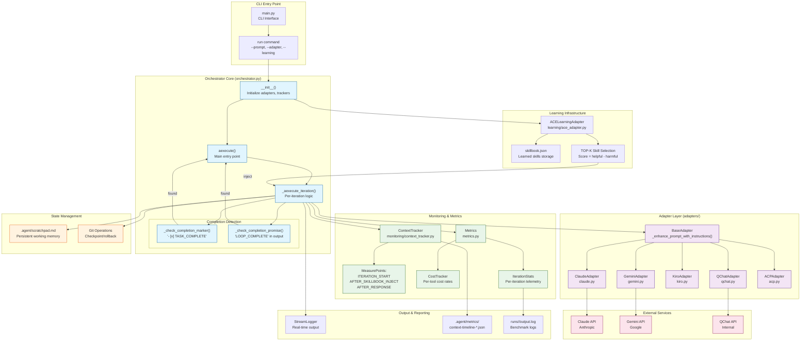

# RALF System Architecture

> **Document Version**: 1.0
> **Last Updated**: 2026-01-11
> **Project**: RALF Context Optimization (RALF-CTXOPT v1.0)

## Executive Summary

The Ralph Orchestrator implements the "Ralph Wiggum Technique" - a continuous loop pattern that runs AI agents iteratively until task completion is detected. This document provides a comprehensive architectural overview of all system components.

---

## System Architecture Diagram



---

## Component Details

### 1. Orchestrator Core (`orchestrator.py`)

The heart of the system - a 1376-line module implementing the continuous execution loop.

```
┌─────────────────────────────────────────────────────────────────────┐
│                         Orchestrator                                 │
├─────────────────────────────────────────────────────────────────────┤
│  __init__()                                                         │
│  ├── Initialize primary adapter (claude/qchat/kiro/gemini/acp)      │
│  ├── Initialize fallback adapters (priority-based)                  │
│  ├── Create ContextTracker(adapter_type, stream_logger)             │
│  ├── Create CostTracker                                             │
│  └── Load skillbook if --learning enabled                           │
├─────────────────────────────────────────────────────────────────────┤
│  aexecute(prompt, max_iterations=10)                                │
│  ├── Load prompt from file or string                                │
│  ├── Check for TASK_COMPLETE marker (pre-loop)                      │
│  └── Enter iteration loop until completion or max_iterations        │
├─────────────────────────────────────────────────────────────────────┤
│  _aexecute_iteration(prompt, iteration_num)                         │
│  ├── MEASURE: ITERATION_START                                       │
│  ├── inject_context() → Add skillbook skills                        │
│  ├── MEASURE: AFTER_SKILLBOOK_INJECT                                │
│  ├── adapter.aexecute(prompt, iteration=N, cwd=CWD)                 │
│  ├── MEASURE: AFTER_RESPONSE                                        │
│  ├── Check completion signals                                       │
│  └── Update scratchpad and metrics                                  │
├─────────────────────────────────────────────────────────────────────┤
│  Completion Detection                                               │
│  ├── _check_completion_marker(prompt_content)                       │
│  │   └── Searches for "- [x] TASK_COMPLETE" in prompt file          │
│  └── _check_completion_promise(agent_output)                        │
│      └── Searches for "LOOP_COMPLETE" in agent response             │
└─────────────────────────────────────────────────────────────────────┘
```

### 2. Adapter Layer (`adapters/`)

Abstraction layer for different AI providers with prompt enhancement.

```
┌─────────────────────────────────────────────────────────────────────┐
│                         BaseAdapter                                  │
├─────────────────────────────────────────────────────────────────────┤
│  _enhance_prompt_with_instructions(prompt, iteration, cwd)          │
│  ├── Iterations 1-3: Full instructions (~800 tokens)                │
│  │   ├── Working Directory: {cwd}                                   │
│  │   ├── Task Completion Signals section                            │
│  │   │   ├── "- [x] TASK_COMPLETE" for prompt files                 │
│  │   │   └── "LOOP_COMPLETE" for output                             │
│  │   └── Full context and guidelines                                │
│  └── Iterations 4+: Condensed instructions (~150 tokens)            │
│      └── KEY REMINDERS only                                         │
├─────────────────────────────────────────────────────────────────────┤
│  Implementations:                                                   │
│  ├── ClaudeAdapter    → Anthropic API (claude-sonnet-4-20250514)    │
│  ├── QChatAdapter     → Internal QChat API                          │
│  ├── KiroAdapter      → Kiro API                                    │
│  ├── GeminiAdapter    → Google Gemini API                           │
│  └── ACPAdapter       → ACP protocol                                │
└─────────────────────────────────────────────────────────────────────┘
```

### 3. Context Tracking (`monitoring/context_tracker.py`)

Token-level measurement for understanding context consumption.

```
┌─────────────────────────────────────────────────────────────────────┐
│                       ContextTracker                                 │
├─────────────────────────────────────────────────────────────────────┤
│  Token Counting                                                     │
│  ├── tiktoken (if available) - Accurate BPE tokenization            │
│  └── Fallback: len(text) // 4 - Character estimation                │
├─────────────────────────────────────────────────────────────────────┤
│  MeasurePoints (Enum)                                               │
│  ├── ITERATION_START        → Base prompt size                      │
│  ├── AFTER_PROMPT_INJECT    → After instructions added              │
│  ├── AFTER_SKILLBOOK_INJECT → After skills injected                 │
│  ├── AFTER_TOOL_CALL        → After tool execution                  │
│  ├── AFTER_RESPONSE         → After agent response                  │
│  └── ITERATION_END          → Final measurement                     │
├─────────────────────────────────────────────────────────────────────┤
│  Context Limits by Adapter                                          │
│  ├── claude:  200,000 tokens                                        │
│  ├── gemini:   32,000 tokens                                        │
│  ├── qchat:     8,000 tokens                                        │
│  ├── kiro:      8,000 tokens                                        │
│  └── default: 100,000 tokens                                        │
├─────────────────────────────────────────────────────────────────────┤
│  Output                                                             │
│  ├── ASCII Timeline: get_timeline_ascii()                           │
│  │   └── Visual bars with 🟢🟡🟠🔴 severity indicators              │
│  └── JSON Export: save_timeline()                                   │
│      └── .agent/metrics/context-timeline-*.json                     │
└─────────────────────────────────────────────────────────────────────┘
```

### 4. Metrics Pipeline (`metrics.py`)

Cost tracking and iteration telemetry.

```
┌─────────────────────────────────────────────────────────────────────┐
│                       Metrics Pipeline                               │
├─────────────────────────────────────────────────────────────────────┤
│  Metrics Dataclass                                                  │
│  ├── iterations: int                                                │
│  ├── successful: int                                                │
│  ├── failed: int                                                    │
│  ├── errors: List[str]                                              │
│  ├── checkpoints: int                                               │
│  └── rollbacks: int                                                 │
├─────────────────────────────────────────────────────────────────────┤
│  CostTracker                                                        │
│  ├── Per-tool cost rates ($/1K tokens)                              │
│  ├── Input/output token tracking                                    │
│  └── Total cost accumulation                                        │
├─────────────────────────────────────────────────────────────────────┤
│  IterationStats                                                     │
│  ├── iteration_number: int                                          │
│  ├── trigger_reason: TriggerReason (enum)                           │
│  ├── input_tokens: int                                              │
│  ├── output_tokens: int                                             │
│  ├── cost: float                                                    │
│  ├── duration_ms: int                                               │
│  └── tools_used: List[str]                                          │
├─────────────────────────────────────────────────────────────────────┤
│  TriggerReason (Enum)                                               │
│  ├── INITIAL           → First iteration                            │
│  ├── CONTINUATION      → Normal continuation                        │
│  ├── TOOL_RESULT       → Triggered by tool output                   │
│  ├── ERROR_RECOVERY    → Recovering from error                      │
│  └── CHECKPOINT_RESUME → Resumed from checkpoint                    │
└─────────────────────────────────────────────────────────────────────┘
```

### 5. Learning Infrastructure (`learning/`)

ACE framework integration for skill learning and injection.

```
┌─────────────────────────────────────────────────────────────────────┐
│                    ACE Learning Adapter                              │
├─────────────────────────────────────────────────────────────────────┤
│  Skillbook Management                                               │
│  ├── Load from .agent/skillbook.json                                │
│  ├── Skills have: name, description, helpful/harmful scores         │
│  └── Embedding support (optional) for semantic matching             │
├─────────────────────────────────────────────────────────────────────┤
│  inject_context(prompt)                                             │
│  ├── Get active skills from skillbook                               │
│  ├── Sort by score: (helpful - harmful)                             │
│  ├── Apply TOP-K filtering if configured                            │
│  └── Inject skill content into prompt                               │
├─────────────────────────────────────────────────────────────────────┤
│  learn_from_execution(result)                                       │
│  ├── Extract patterns from successful execution                     │
│  ├── Update skill scores based on outcomes                          │
│  └── Persist to skillbook.json                                      │
└─────────────────────────────────────────────────────────────────────┘
```

### 6. Benchmark Runner

Testing and validation infrastructure.

```
┌─────────────────────────────────────────────────────────────────────┐
│                      Benchmark System                                │
├─────────────────────────────────────────────────────────────────────┤
│  Benchmark Tiers                                                    │
│  ├── tier0: Simple tasks (greeting.py - print hello)                │
│  ├── tier1: Basic tasks (datetime_printer.py)                       │
│  ├── tier2: Complex tasks (cli_tool.md - multi-module)              │
│  ├── tier3: Web tasks (web_scraper.md)                              │
│  └── tier4: Advanced tasks                                          │
├─────────────────────────────────────────────────────────────────────┤
│  Output Structure                                                   │
│  └── runs/                                                          │
│      └── baseline-YYYYMMDD/                                         │
│          ├── tier0/                                                 │
│          │   └── output.log                                         │
│          ├── tier1/                                                 │
│          │   └── output.log                                         │
│          └── ...                                                    │
├─────────────────────────────────────────────────────────────────────┤
│  Metrics Collected                                                  │
│  ├── Iterations to complete                                         │
│  ├── Total cost ($)                                                 │
│  ├── Path hallucination detected (Y/N)                              │
│  ├── Completion signal used (TASK_COMPLETE/LOOP_COMPLETE)           │
│  └── Context timeline JSON                                          │
└─────────────────────────────────────────────────────────────────────┘
```

---

## Data Flow Diagram

```
┌──────────────────────────────────────────────────────────────────────────────┐
│                              ORCHESTRATION FLOW                               │
└──────────────────────────────────────────────────────────────────────────────┘

    ┌─────────┐
    │  User   │
    └────┬────┘
         │ ralph run --prompt task.md --adapter claude
         ▼
    ┌─────────────────────────────────────────────────────────────────────────┐
    │                           INITIALIZATION                                 │
    │  ┌──────────────┐    ┌──────────────┐    ┌──────────────┐               │
    │  │ Load Prompt  │───▶│ Init Adapter │───▶│ Init Tracker │               │
    │  └──────────────┘    └──────────────┘    └──────────────┘               │
    └─────────────────────────────────────────┬───────────────────────────────┘
                                              │
                                              ▼
    ┌─────────────────────────────────────────────────────────────────────────┐
    │                         ITERATION LOOP                                   │
    │                                                                          │
    │  ┌─────────────────────────────────────────────────────────────────┐    │
    │  │ ITERATION N                                                      │    │
    │  │                                                                  │    │
    │  │  ┌────────────┐     ┌────────────┐     ┌────────────┐           │    │
    │  │  │  MEASURE   │────▶│   INJECT   │────▶│  MEASURE   │           │    │
    │  │  │  START     │     │  SKILLBOOK │     │  INJECT    │           │    │
    │  │  │  (68 tok)  │     │            │     │  (+skills) │           │    │
    │  │  └────────────┘     └────────────┘     └────────────┘           │    │
    │  │        │                                     │                   │    │
    │  │        │         ┌───────────────────────────┘                   │    │
    │  │        │         │                                               │    │
    │  │        │         ▼                                               │    │
    │  │        │  ┌────────────────────────────────────────────────┐    │    │
    │  │        │  │              ADAPTER EXECUTION                  │    │    │
    │  │        │  │  ┌─────────────────────────────────────────┐   │    │    │
    │  │        │  │  │ _enhance_prompt_with_instructions()     │   │    │    │
    │  │        │  │  │ ├── Add CWD (Phase 3 fix)               │   │    │    │
    │  │        │  │  │ ├── Add completion signals (Phase 1)    │   │    │    │
    │  │        │  │  │ └── Dynamic templates (iter 1-3 vs 4+)  │   │    │    │
    │  │        │  │  └─────────────────────────────────────────┘   │    │    │
    │  │        │  │                      │                          │    │    │
    │  │        │  │                      ▼                          │    │    │
    │  │        │  │  ┌─────────────────────────────────────────┐   │    │    │
    │  │        │  │  │           CLAUDE API CALL                │   │    │    │
    │  │        │  │  │  (or other adapter: qchat/kiro/gemini)   │   │    │    │
    │  │        │  │  └─────────────────────────────────────────┘   │    │    │
    │  │        │  └────────────────────────────────────────────────┘    │    │
    │  │        │                         │                               │    │
    │  │        │                         ▼                               │    │
    │  │        │  ┌────────────┐    ┌────────────┐                      │    │
    │  │        └─▶│  MEASURE   │───▶│  CHECK     │                      │    │
    │  │           │  RESPONSE  │    │ COMPLETION │                      │    │
    │  │           │ (306 tok)  │    │            │                      │    │
    │  │           └────────────┘    └─────┬──────┘                      │    │
    │  │                                   │                              │    │
    │  └───────────────────────────────────┼──────────────────────────────┘    │
    │                                      │                                   │
    │                    ┌─────────────────┴─────────────────┐                 │
    │                    ▼                                   ▼                 │
    │         ┌──────────────────┐               ┌──────────────────┐          │
    │         │ LOOP_COMPLETE    │               │ Continue to      │          │
    │         │ detected in      │               │ iteration N+1    │          │
    │         │ agent output     │               │                  │          │
    │         └────────┬─────────┘               └──────────────────┘          │
    │                  │                                                       │
    └──────────────────┼───────────────────────────────────────────────────────┘
                       │
                       ▼
    ┌─────────────────────────────────────────────────────────────────────────┐
    │                            FINALIZATION                                  │
    │  ┌──────────────┐    ┌──────────────┐    ┌──────────────┐               │
    │  │ Save Context │───▶│ Save Metrics │───▶│ Output Report│               │
    │  │   Timeline   │    │    JSON      │    │              │               │
    │  └──────────────┘    └──────────────┘    └──────────────┘               │
    └─────────────────────────────────────────────────────────────────────────┘
```

---

## File Structure

```
ralph-orchestrator/
├── src/ralph_orchestrator/
│   ├── __init__.py
│   ├── orchestrator.py          # Core loop (1376 lines)
│   ├── metrics.py               # Cost/iteration tracking (348 lines)
│   ├── adapters/
│   │   ├── __init__.py
│   │   ├── base.py              # BaseAdapter with prompt enhancement
│   │   ├── claude.py            # ClaudeAdapter
│   │   ├── qchat.py             # QChatAdapter
│   │   ├── kiro.py              # KiroAdapter
│   │   ├── gemini.py            # GeminiAdapter
│   │   └── acp.py               # ACPAdapter
│   ├── monitoring/
│   │   ├── __init__.py
│   │   └── context_tracker.py   # Token tracking (329 lines)
│   └── learning/
│       ├── __init__.py
│       └── ace_adapter.py       # ACE framework integration
├── .agent/
│   ├── scratchpad.md            # Persistent agent memory
│   ├── skillbook.json           # Learned skills
│   └── metrics/
│       └── context-timeline-*.json  # Token measurement exports
├── runs/
│   └── baseline-YYYYMMDD/       # Benchmark results
│       ├── tier0/output.log
│       ├── tier1/output.log
│       └── ...
├── examples/
│   ├── simple-task.md           # Tier 0-1 prompts
│   ├── cli_tool.md              # Tier 2 complex prompt
│   └── web_scraper.md           # Tier 3 web prompt
└── .planning/
    ├── BRIEF.md                 # Project brief
    ├── ROADMAP.md               # Implementation roadmap
    └── UNDERSTANDING.md         # Research status
```

---

## Key Integration Points

| Component | Integrates With | Data Exchanged |
|-----------|-----------------|----------------|
| Orchestrator | Adapters | Prompt + iteration + CWD |
| Orchestrator | ContextTracker | Content string for measurement |
| Orchestrator | CostTracker | Token counts per iteration |
| Orchestrator | ACEAdapter | Skillbook content for injection |
| Adapters | External APIs | HTTP requests/responses |
| ContextTracker | StreamLogger | Real-time usage updates |
| ContextTracker | File System | JSON timeline exports |
| ACEAdapter | Skillbook | Skill loading and updating |

---

## Configuration

### Environment Variables

| Variable | Purpose | Default |
|----------|---------|---------|
| `ANTHROPIC_API_KEY` | Claude API authentication | Required |
| `GEMINI_API_KEY` | Gemini API authentication | Optional |
| `QCHAT_API_URL` | QChat endpoint | Optional |

### CLI Options

```bash
ralph run \
  --prompt <file.md>           # Prompt file path
  --adapter <claude|qchat|...> # Primary adapter
  --max-iterations <N>         # Max iterations (default: 10)
  --learning                   # Enable ACE skillbook
  --output-dir <path>          # Output directory
```

---

*Generated by RALF System Architecture Documentation v1.0*
