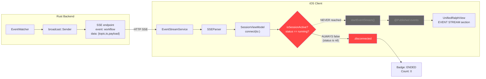
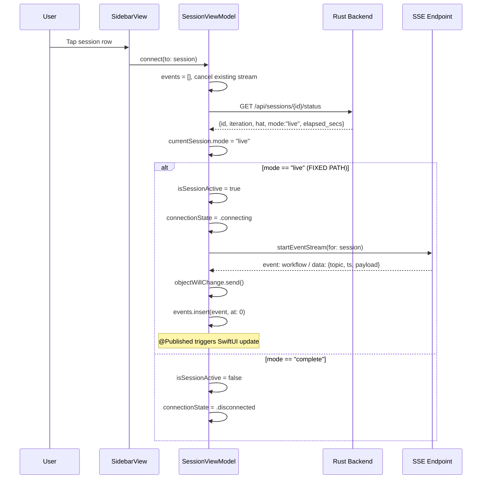

# Design: iOS SSE Event Stream Fix

## Overview

Fix `isSessionActive` (SessionViewModel.swift:440-443) to check backend-provided `mode == "live"` instead of nonexistent `status` field. This unblocks the SSE connection gate at line 151, allowing events to flow into the UI. Single computed property change, zero backend modifications.

## Architecture

### Before (Broken)



### After (Fixed)

```mermaid
graph LR
    subgraph Rust["Rust Backend"]
        EW[EventWatcher] --> BC[broadcast::Sender]
        BC --> SSE["SSE endpoint<br/>event: workflow<br/>data: {topic,ts,payload}"]
    end

    subgraph iOS["iOS Client"]
        ESS[EventStreamService] --> SP[SSEParser]
        SP --> VM["SessionViewModel<br/>connect(to:)"]
        VM --> GATE{"isSessionActive?<br/>mode == live?"}
        GATE -->|"true (mode=live)"| START["startEventStream()"]
        GATE -->|"false (mode=complete)"| DISC[".disconnected"]
        START --> STREAM["for try await event in stream"]
        STREAM --> OBJ["objectWillChange.send()"]
        OBJ --> EVENTS["events.insert(event, at: 0)"]
        EVENTS --> UI["UnifiedRalphView<br/>EVENT STREAM section"]
    end

    SSE -->|"HTTP SSE"| ESS
    UI --> BADGE["Badge: event count<br/>Live updates"]

    style GATE fill:#00cc66,color:#fff
    style START fill:#00cc66,color:#fff
    style EVENTS fill:#00cc66,color:#fff
```



## Components

### SessionViewModel.isSessionActive (ONLY CHANGE)

**Purpose**: Gate that determines whether to start SSE stream for a session

**Current logic** (broken):
```swift
var isSessionActive: Bool {
    guard let status = currentSession?.status else { return false }
    return status == "running" || status == "paused"
}
```

**Fixed logic**:
```swift
var isSessionActive: Bool {
    guard let session = currentSession else { return false }
    // Backend-provided liveness (always present after fetchSessionStatus)
    if session.mode == "live" { return true }
    // iOS-only local state (set by pauseRun/resumeRun)
    if let status = session.status {
        return status == "running" || status == "paused"
    }
    return false
}
```

**Downstream consumers** (all in `UnifiedRalphView.swift`, NO changes needed):

| Line | Usage | Behavior Change |
|------|-------|-----------------|
| 31 | `!isSessionActive` -> show ended banner | Now hidden for live sessions |
| 61 | `isSessionActive` -> show signal emission | Now visible for live sessions |
| 82 | `isSessionActive` -> show steering FAB | Now visible for live sessions |
| 495 | Badge: `isSessionActive ? "\(events.count)" : "ENDED"` | Now shows live count |
| 497 | `!isSessionActive && events.isEmpty` -> show "no events" | Now shows event stream |
| 555 | Scratchpad badge: `isSessionActive ? "LIVE" : "HISTORICAL"` | Now shows "LIVE" |

## Data Flow



## Technical Decisions

| Decision | Options Considered | Choice | Rationale |
|----------|-------------------|--------|-----------|
| Liveness source | A: Use `mode` from backend, B: Add `status` to backend, C: Both | A | Zero backend changes, `mode` already present in API, semantic equivalent of "running" |
| Priority order | mode-first vs status-first | mode-first | `mode` is authoritative (from backend); `status` is local-only (pause/resume). Backend truth wins. |
| Preserve `status` | Remove status checks vs keep | Keep | `pauseRun()`/`resumeRun()` set `status` locally. Removing would break pause/resume. |
| SwiftUI reactivity | Add extra refresh triggers vs trust existing | Trust existing | `objectWillChange.send()` at line 189 was added as prior fix. Validate empirically. |

## File Structure

| File | Action | Purpose |
|------|--------|---------|
| `ios/RalphMobile/ViewModels/SessionViewModel.swift` | **Modify** lines 440-443 | Fix `isSessionActive` to check `mode == "live"` |

No other files modified. No new files created.

## Error Handling

| Error Scenario | Handling Strategy | User Impact |
|----------------|-------------------|-------------|
| `mode` is `nil` (list endpoint, no status fetched) | Falls through to `status` check, then returns `false` | Session treated as inactive until status fetched |
| `mode` is unexpected value (not "live" or "complete") | Falls through to `status` check, defaults `false` | Safe fallback -- no SSE attempt |
| SSE connection fails after `isSessionActive = true` | Existing `scheduleReconnect` with exponential backoff (lines 212-229) | Auto-reconnects up to max attempts |
| `fetchSessionStatus` fails before gate check | `currentSession` set from list data (no `mode`), falls through to `false` | Shows disconnected, user can retry |

## Edge Cases

- **Race: session completes between status fetch and SSE start** -- SSE stream ends normally, triggers `scheduleReconnect`, which will re-fetch and find `mode == "complete"`, stopping reconnection. Safe.
- **Pause during live session** -- `pauseRun()` sets `status = "paused"`, `isSessionActive` returns `true` (via status branch). SSE stays connected. Correct per AC-3.3.
- **Resume after pause** -- `resumeRun()` sets `status = "running"`, still active. Correct.
- **Both `mode` and `status` present** -- `mode == "live"` wins (checked first). Prevents conflict between backend "complete" and stale local "running".
- **App backgrounding** -- URLSession handles connection lifecycle; existing reconnection logic covers drops. No change needed.
- **Multiple rapid session switches** -- `connect(to:)` cancels previous `eventStreamTask` at line 139. Existing pattern handles this.

## Validation Strategy

Per CLAUDE.md mandate: functional validation only, no unit tests.

### Build Verification (Gate 5)
```bash
xcodebuild -scheme RalphMobile -destination 'id=23859335-3786-4AB4-BE26-9EC0BD8D0B57' build
cargo test -p ralph-mobile-server
```

### Functional Validation (Gate 2 + Gate 4)

| Step | Action | Expected Result |
|------|--------|-----------------|
| 1 | Start backend: `cargo run --bin ralph-mobile-server -- --bind-all --show-key` | Server on 8080 |
| 2 | Configure iOS Settings with LAN IP + API key | Settings saved |
| 3 | Start ralph loop: `ralph run -c presets/feature.yml -p "test" --max-iterations 10` | Loop produces events |
| 4 | Tap live session in sidebar | `connectionState` transitions to `.connected` |
| 5 | Observe EVENT STREAM section | Badge shows count > 0, events flowing |
| 6 | Wait 10 minutes | Events continue without drops (Gate 4) |
| 7 | Record video: `xcrun simctl io booted recordVideo sse-fix-validation.mp4` | Video evidence |
| 8 | Tap completed session | Badge shows "ENDED", no SSE connection |
| 9 | Test pause/resume | SSE stays connected during pause |

### Evidence Artifacts
- Screenshot: EVENT STREAM with live event count
- Screenshot: Completed session showing "ENDED"
- Video: 10-minute continuous streaming session
- All saved to `ios/validation-screenshots/`

## Implementation Steps

1. Modify `isSessionActive` in `SessionViewModel.swift` (lines 440-443) to check `mode == "live"` first, then fall back to local `status`
2. Build iOS app, verify zero errors
3. Start ralph-mobile-server with `--bind-all`
4. Start real ralph loop for SSE testing
5. Validate events appear in EVENT STREAM section
6. Record 10-minute video evidence
7. Verify completed sessions show read-only state
8. Save all evidence to `ios/validation-screenshots/`
